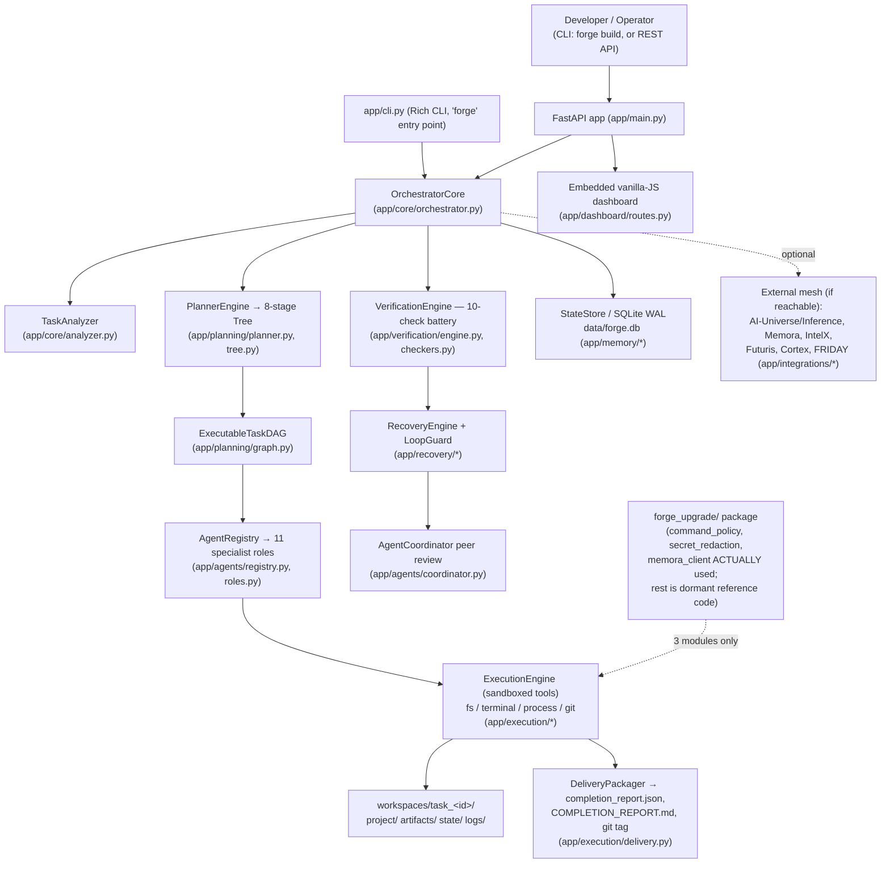
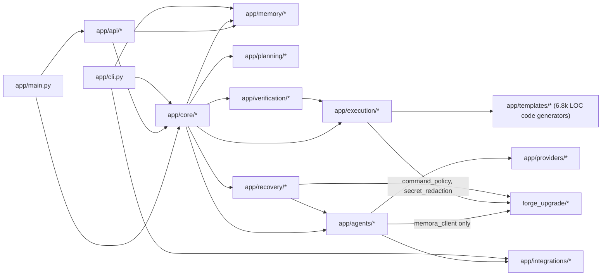

# Repository Comprehension Report — `surendra2304/Forge`

Analysis date: 2026-10-07. Branch analyzed: `arena/123c48c7-forge` (`main` @ `ab049ac7`).
Methodology: static reading of all meta-docs and the majority of `app/`/`forge_upgrade/`/`tests/`, plus live execution (venv build, `ruff`, full `pytest` run, booted the FastAPI server, submitted a real autonomous build, `pip-audit`, secret scan). Working notes: `notes/raw-findings.md`.

---

## 0. TL;DR

- **FORGE is a real, working, single-author autonomous software-engineering agent**: a FastAPI service + Rich CLI that takes a plain-English goal, plans an 8-stage DAG, dispatches 11 specialist LLM-backed agent roles, writes real files into a sandboxed workspace, runs a 10-check verification battery, self-repairs on failure, and packages a delivery report with a local git tag. [FACT, verified live — see §12]
- It is pure Python (`app/` ≈ 30k LOC, `tests/` ≈ 11.9k LOC, `forge_upgrade/` ≈ 1.8k LOC, 251 `.py` files, 47,568 total Python lines) built on FastAPI/Pydantic v2/aiosqlite, with zero other languages in the repo. [FACT — `wc -l`, `find`]
- **Verified bug, found live, not just read**: the shipped `completion_report.json` ("evidence over model confidence") can report `all_passed: true` while the real verification battery has failing checks, because `DeliveryPackager` runs during the DAG's Release stage *before* the orchestrator's post-hoc `VerificationEngine.verify_task()` call ever writes `verification_report.json`. Reproduced end-to-end: completion report claimed `total_checks: 0, all_passed: true`; the verification report generated 300ms later showed `8/10 passed`. [FACT — §5.1]
- **Orphaned subsystems**: `app/security/api_keys.py`'s sliding-window rate limiter/API-key manager is fully built but never wired into any route (`verify_api_key` has zero callers); most of `forge_upgrade/` (its own orchestrator, DAG, budget controller, patch applier, repo intelligence) is tested in isolation but never imported by the production app — only `command_policy`, `secret_redaction`, and `memora_client` are actually consumed. [FACT — grep-verified, §7, §13]
- **Docs vs. code conflict on "standalone"**: README/`docs/ARCHITECTURE.md` say FORGE is "100% independent" with external integrations "deferred"; `SYSTEM_MANIFEST.md` (committed in the same repo) describes FORGE as one of 9 live agents in the "FRIDAY Universe" with delegation endpoints, and the code (`app/api/delegate.py`, `render.yaml`, `app/core/config.py`) is pre-wired to 7 external `*.onrender.com` services. Both are true in different senses — it degrades gracefully to standalone when those services are unreachable (observed live). [FACT + INFERENCE — §9, §15]
- **CI only truly tests on Windows**: the Linux CI leg does lint + an import smoke test only, because the 7 GB Ubuntu runner OOMs running pytest; the full suite (including golden end-to-end benchmarks) runs exclusively on `windows-latest`. [FACT — `.github/workflows/ci.yml`]
- Full test suite: 416 tests collected, 1 conditional skip, rest pass in ~72s — but **only when the venv's `bin/` is on `PATH`**, because the verification engine shells out to a bare `ruff` command; without that, 7 tests and any real build's lint/code-quality checks fail with exit 127. [FACT — reproduced both ways]
- `pyproject.toml` declares `license = {text = "MIT"}` but **no `LICENSE` file exists in the repository**. No dependency lockfile exists; all dependencies are floating `>=` minimums. [FACT]
- Docker/production defaults are self-contradictory: `docker-compose.yml` sets `FORGE_ENV=production` + `API_KEY_REQUIRED=false` with no `FORGE_API_KEY`, but the actual auth middleware ignores `API_KEY_REQUIRED` and unconditionally demands a 32+ char key once `FORGE_ENV=production` — so `docker compose up -d --build` as documented boots a container whose entire data API returns `503 service_auth_unconfigured`. [FACT — reproduced live]
- Engineering culture is unusually self-documenting: there isn't a single `TODO`/`FIXME`/`HACK` in `app/` or `forge_upgrade/`; instead almost every non-trivial fix carries a multi-line comment narrating the exact historical bug, how it was proven live, and the fix — a de facto in-code changelog across 112 commits in ~6 weeks by one author.

---

## 1. Executive Summary

Project FORGE is a standalone **autonomous software-engineering engine**: given a natural-language goal ("Build a CLI Todo app"), it plans an 8-stage engineering pipeline (Project → Requirements → Architecture → Implementation → Integration → Verification → Security → Release), executes it as a dependency DAG with 11 specialist agent roles (planner, architect, frontend, backend, developer, tester, security_reviewer, debugger, code_reviewer, release_engineer, plus a `codebase_analyzer`), runs a 10-check objective verification battery (build/syntax, lint, tests, runtime smoke, security/secret scan, CVE scan, feature-presence, performance, code-quality, accessibility), attempts self-repair on failures, and packages a delivery (`completion_report.json`, `COMPLETION_REPORT.md`, a locally git-tagged release) — all confined to a per-task sandbox under `workspaces/task_<id>/` [FACT — `app/core/orchestrator.py`, `app/planning/planner.py`, `app/verification/`, `app/recovery/`, `app/execution/delivery.py`].

It is exposed via a FastAPI REST/WebSocket API (`app/main.py`, `app/api/*`) and a Rich-based CLI (`app/cli.py`, `forge` console script). It persists state in a single-file SQLite database (WAL mode) with no multi-tenant model — it is designed to be run by one operator. A second, almost-entirely-dormant package, `forge_upgrade/`, was merged wholesale in one commit as a "deep upgrade overlay"; only three of its ~20 modules (`command_policy`, `secret_redaction`, `memora_client`) are actually imported by the live application — the rest is reference code exercised only by its own unit tests.

The system was built by a single author ("Surendra"/"surendra2304") over roughly six weeks (2026-08-25 → 2026-10-07, 112 commits) at a near-daily cadence, with heavy use of self-authored audit/handoff documents (`AUDIT_REPORT.md`, `FORGE_UPGRADE_AUDIT.md`, `HANDOFF_2026-10-05_PHASE5.md`, `HANDOFF_2026-10-06_PHASE6.md`, a 229-line `FORGE_DIARY.md`, and a `diary/` folder of daily logs). The codebase is unusually candid about its own history: nearly every substantial fix is accompanied by an inline comment describing the exact bug it replaced, often with "verified live" reproduction notes.

**Health assessment**: the core engine is real, exercised, and — per this audit's live run — produces working software end to end, including graceful degradation when all configured external AI/memory services are unreachable (verified: TLS to `inference-h7bn.onrender.com` and `memora-cavc.onrender.com` failed in this sandbox, and the engine fell back to local `DirectProvider` reasoning without crashing). Its weakest areas are (a) a verification/delivery sequencing bug that undermines its own "evidence over confidence" headline claim, (b) auth/rate-limiting code that doesn't match what's actually enforced, (c) test-isolation gaps that let some test files write into the real development database, and (d) a CI pipeline whose only full test gate runs on Windows. None of these are install-blocking; all are concrete, fixable, and documented below with file:line evidence.

---

## 2. Fact Sheet

| Attribute | Value |
|---|---|
| Name | Project FORGE (`forge-engine`, `pyproject.toml:4`) |
| Purpose | Autonomous software-engineering agent: goal → planned, synthesized, verified, self-repaired, packaged software artifact |
| Primary language | Python 3.11 (100% of source; 251 `.py` files, 47,568 lines) [FACT] |
| Framework(s) | FastAPI 0.142 (installed), Pydantic v2, aiosqlite, Uvicorn, Rich (CLI), httpx (outbound), OpenAI/Anthropic SDKs (optional providers) |
| License | Declared **MIT** in `pyproject.toml:11`; **no `LICENSE` file present in the repo** [FACT — discrepancy] |
| Repo size | 289 tracked files total (excluding `.git`); 251 `.py`, 27 `.md` [FACT — `find`/ext count] |
| Age | First commit 2026-08-25, latest 2026-10-07 → ~6 weeks [FACT — `git log`] |
| Activity | 112 commits, 1 contributor (two git identities: "Surendra" ×104, "surendra2304" ×8) [FACT] |
| Test posture | 416 tests collected; full-suite pass with venv `bin/` on `PATH` (1 conditional skip); CI's only full-suite gate is Windows-only [FACT] |
| Deployment model | Single-process FastAPI app behind Uvicorn; Docker image, docker-compose, Render.com manifest, and a systemd unit all present; SQLite as sole datastore (no external DB/cache) |
| Overall health grade | **B-** — functional, well-tested core; genuine process-integrity and documentation-accuracy issues that a new tech lead must know before trusting its own "verified" output |

---

## 3. Architecture

### 3.1 System diagram

### 3.2 Module dependency map (directories, not full call graph)

No circular imports were observed in the directories actually exercised by the app; `forge_upgrade` is a one-way dependency sink (app → forge_upgrade, never back). [INFERENCE from grep of all `forge_upgrade.*` imports, §7/notes]

### 3.3 Architectural pattern

This is a **layered, orchestrator-centric modular monolith**, not a microservice system: one FastAPI process hosts everything (API, orchestration, agents, verification, delivery), with a single SQLite file as the system of record [FACT — `app/memory/db.py`, `app/core/config.py:29-31`]. Within that monolith it implements:
- A **DAG/workflow engine** (`app/planning/graph.py::ExecutableTaskDAG`) with Kahn's-algorithm-style cycle validation [FACT — referenced in `FORGE_UPGRADE_AUDIT.md` §3.5 and exercised by `dag.validate()` in `app/core/orchestrator.py:214-218`].
- A **role-based multi-agent pattern** (`app/agents/roles.py`, 1629 lines, 11 `BaseAgent` subclasses) each with its own system prompt and `execute_step`.
- A **pipeline/verification-gate pattern** (`PipelineStage` enum with `VERIFICATION_GATE`/`MILESTONE` node types, `app/planning/tree.py:16-33`).
- A **provider abstraction** (`app/providers/base.py` + `factory.py`) implementing a 3-tier fallback: external AI-Universe → OpenAI/Anthropic/Direct → deterministic template engine (`docs/PROJECT_TYPES.md` §2, confirmed live when external calls failed).

Process boundaries: there is exactly one long-running process (the FastAPI/Uvicorn server, or the one-shot CLI). Background work (DAG waves) runs as `asyncio` tasks inside that same process (`asyncio.gather` in `app/core/orchestrator.py:338`), not as separate workers/queues. Each task's generated project gets its **own local git repository** inside its sandbox (`workspaces/task_<id>/project/.git`) — observed live — which is distinct from the main FORGE repository.

---

## 4. How It Runs

### 4.1 Entry points

| Entry point | File | Notes |
|---|---|---|
| FastAPI app factory | `app/main.py:create_app()` (`app.main:app` module attribute) | Used by `uvicorn app.main:app` and the Dockerfile `ENTRYPOINT` |
| CLI | `app/cli.py:main()`, registered as console script `forge` (`pyproject.toml:46-47`) | `forge build`, `status`, `logs`, `inspect` per README |
| `__main__` direct run | `app/main.py:270-277` | `python -m app.main` launches Uvicorn using `Settings.host/port/debug` |

### 4.2 Startup sequence (traced from `app/main.py`)

1. `create_app()` reads `get_settings()` (cached `Settings` singleton, `app/core/config.py:169-173`).
2. FastAPI app constructed with a custom `generate_unique_id_function` and a patched `openapi()` to de-duplicate operation IDs across the app's many duplicate router mounts (`app/main.py:62-120` — the code comments explain this was needed because routers are mounted at `""`, `/api`, and `/api/v1` simultaneously).
3. `lifespan()` context manager runs on startup (`app/main.py:35-48`): loads settings → `setup_logging(debug=...)` → `settings.ensure_directories()` (creates `data/`, `workspaces/`, `artifacts/`) → `db_manager.init_db()` (creates/upgrades SQLite schema, idempotent `ALTER TABLE ... ADD COLUMN` with swallowed "duplicate column" errors — `app/memory/db.py`) → `performance_optimizer.optimize_sqlite_pragmas()` (WAL, `synchronous=NORMAL`, 64 MB cache — confirmed in live boot logs).
4. Three `@app.middleware("http")` layers registered in order: `require_production_api_key` (only active when `env==production`) → `limit_request_body` (8 MB cap via `Content-Length`) → `record_request_telemetry` (feeds Prometheus-style counters). Then `CORSMiddleware` with `allow_origins=["*"]`/`allow_credentials=True` and GZip via `performance_optimizer.apply_fastapi_optimizations(app)`.
5. ~15 router mounts register the full endpoint surface (health, core API at `""`/`/api`/`/api/v1`, tasks, delegate, analytics, improvement, marketplace, websocket, dashboard) — see §6.
6. `app = create_app()` module-level instantiation; `uvicorn` imports this `app` object.

### 4.3 Configuration inventory (selected; full set in `app/core/config.py` + `app/config/production.py`)

| Variable | Purpose | Default | Where read | Required? | Notes |
|---|---|---|---|---|---|
| `FORGE_ENV` | Environment stage (`development`/`staging`/`production`) | `development` | `app/core/config.py:20-24`, `app/config/production.py:17-19` | No | Code comment explicitly documents a historical bug where these two settings disagreed |
| `FORGE_HOST` / `FORGE_PORT` | Bind address | `0.0.0.0` / `8000` | `app/core/config.py:27-28` | No | |
| `FORGE_DATABASE_PATH` | SQLite file | `data/forge.db` | `app/core/config.py:31` | No | Relative to CWD; see §13 test-isolation finding |
| `DEFAULT_PROVIDER` / `DEFAULT_MODEL` | LLM provider selection | `direct` / `direct-default` | `app/core/config.py:34-46` | No | `direct` = local/template fallback, no external call |
| `OPENAI_API_KEY`, `ANTHROPIC_API_KEY`, `GEMINI_API_KEY` | Optional provider credentials | blank | `app/core/config.py:50-72` | No | |
| `GITHUB_TOKEN` / `GITHUB_REPO` | Delivery push target | blank | `app/core/config.py:75-83` | No | |
| `FORGE_GIT_PUSH_TOKEN` | Elevated push authorization gate | blank (fails closed) | `app/core/config.py:138-144` | No | Comment: "no presented token can satisfy the push gate" when unset |
| `INFERENCE_URL` / `INFERENCE_API_KEY` (aka `AI_UNIVERSE_*`) | External reasoning engine | `https://inference-h7bn.onrender.com` | `app/core/config.py:86-96` | No | Live default URL baked in; falls back gracefully if unreachable |
| `INTELX_URL`/`FUTURIS_URL`/`CORTEX_URL`/`MEMORA_URL` + API keys | Sibling "FRIDAY Universe" services | all default to live `*.onrender.com` URLs | `app/core/config.py:98-145` | No | See §15 discrepancy with "standalone" claim |
| `FORGE_API_KEY` | Auth secret for the production middleware **and** aliased as `memora_api_key` | None | `app/config/production.py:33`, also aliased `app/core/config.py:140-146` | **Yes, in production** | Same env var name serves two different Settings fields — see §13 |
| `FRIDAY_API_KEY` | Caller credential accepted alongside FORGE's own key | None | `app/config/production.py:35-37`, `app/main.py:148-162` | No | Lets the FRIDAY mesh peer authenticate to FORGE |
| `API_KEY_REQUIRED` | Documented toggle for auth requirement | env-dependent | `app/config/production.py:29-32` | No | **Not actually consulted by the enforcing middleware** — see §13 |
| `CORS_ORIGINS` | CORS allow-list for `ProductionSettings` | `*` | `app/config/production.py:40-42` | No | Not actually used — `app/main.py` hardcodes `allow_origins=["*"]` regardless |
| `.env.example` | Full documented template | — | repo root | — | Ships with every secret blank; commit message explicitly calls out removing prior placeholder secrets |

### 4.4 Shutdown / failure behavior

- Shutdown: `lifespan()`'s code after `yield` just logs "Shutting down..." (`app/main.py:49`) — no explicit flush/drain logic beyond FastAPI/Uvicorn's own graceful shutdown.
- Health/readiness: `GET /health` (liveness, DB connectivity flag), `GET /health/ready` (DB + workspace-writability check), `GET /health/detailed` (DB latency, AI-Universe reachability, system CPU/mem/disk, security-scanner counters, active alerts) — all in `app/api/health.py`. Verified live: all three return 200 on a cold boot.
- Boot failure paths: if `FORGE_ENV=production` and no valid `FORGE_API_KEY` is configured, the app **still boots and serves `/health`**, but every other endpoint returns `503 service_auth_unconfigured` (verified live, §13) — a deliberate fail-closed design for the key itself, though arguably it should fail at boot rather than per-request.

---

## 5. Deep Dives

### 5.1 Core flow trace: autonomous build (the system's primary flow)

Chosen because it is the literal reason the project exists (README's value proposition) and because it touches every subsystem. Traced by reading code **and** by executing it live (see §12).

1. **Entry**: `POST /api/tasks` → `app/api/tasks.py:176` (also duplicated at `app/api/routes.py:137`, intentionally — comment at `app/main.py:233-243` explains the overlapping-router resolution order).
2. **Validation**: request body parsed into a Pydantic schema (`app/api/schemas.py`); `app/main.py`'s `limit_request_body` middleware rejects bodies > 8 MB before the handler runs.
3. **Business rules** (`OrchestratorCore.intake_and_plan`, `app/core/orchestrator.py:89-234`):
   - Generates a collision-resistant task ID (`generate_task_id`, `task%02d%d%m%Y%H%M%S` format) with a documented fix for a proven race condition (comment at lines 99-109 cites "25 parallel POST /api/tasks produced 23× 500" as the original failure mode).
   - Provisions an isolated workspace via `WorkspaceManager.create_workspace` (`app/core/workspace.py`).
   - Strips control characters from the goal (`_sanitize_text`, lines 44-55) — documented fix for a NUL-byte crash in the release_engineer node.
   - Persists `TaskEntity(state=PENDING)`, retries once on a UNIQUE collision.
   - Calls `TaskAnalyzer.analyze()` then `PlannerEngine.plan()` to build the 8-stage `HierarchicalTaskTree`, converts it to `ExecutableTaskDAG`, validates (cycle check), persists the graph, transitions task to `READY`.
4. **Side effects so far**: workspace directories created on disk; `task.created`, `task.analyzed`, `plan.created` audit events recorded (`StateStore.record_event`); `production_monitor.record_task_event("submitted")` increments the Prometheus-style counter.
5. **Execution** (`OrchestratorCore.step_task` / `run_task`, lines 236-466): repeatedly executes all currently-ready DAG nodes in parallel (`asyncio.gather` over `_execute_single_node`), each dispatched to the DAG node's `assigned_agent` via `AgentRegistry.create_agent(role_name)` then `agent.execute_step(...)`. Node success/failure updates the DAG and emits `node.completed`/`node.failed` audit events; verification-gate/milestone nodes trigger a `TaskStateMachine.checkpoint()`.
6. **Completion check**: when no nodes remain ready and the DAG reports completed, the orchestrator checks for a `FALLBACK_STUB.json` marker or any node result flagged `fallback_stub` — if present, the task is marked **FAILED** even though every node "succeeded," specifically to avoid silently shipping template-stub output as if it were real synthesis (`app/core/orchestrator.py:255-283`).
7. **Verification & repair** (`_verify_and_repair`, lines 495-556), called **after** the DAG loop (i.e., after Release has already run — see the bug below): constructs a fresh `VerificationEngine` bound to the orchestrator's own `ExecutionEngine`/`WorkspaceManager` (explicitly not the module-level singletons, with a documented past bug where that caused isolated-run verification to target the wrong directory), runs the 10-check battery, and on any failure invokes `RecoveryEngine.attempt_recovery()` per failing check, then a 2-round `AgentCoordinator.review_and_repair()` peer-review pass.
8. **Error paths**: any exception inside `_verify_and_repair` is caught and logged, deliberately **not** reverting the task's terminal state ("Verification is a reporting gate, not a reason to kill a finished task," line 553-554). A failed DAG node causes the whole task to transition to `FAILED` with the first error message recorded.
9. **End state / response shape**: task reaches `COMPLETED`/`FAILED`/`BLOCKED`/`CANCELLED`; consumers read it via `GET /api/tasks/{id}` (progress, stage, ETA), `GET /api/tasks/{id}/artifacts`, and the generated `workspaces/<id>/artifacts/{completion_report.json, COMPLETION_REPORT.md, verification_report.json, verification_manifest.json}`.

#### ⚠️ Verified defect in this flow: stale verification status in the delivered report

- The DAG's **Release** stage (`assigned_role="release_engineer"`, `app/planning/planner.py:200-209`) depends only on the **Security** stage, which depends on **Verification** (`assigned_role="tester"`). The "tester" role (`TesterRole.execute_step`, `app/agents/roles.py:1135+`) writes/extends test files — it does **not** call `VerificationEngine`.
- `ReleaseEngineerRole.execute_step` (`app/agents/roles.py:1427-1441`) calls `DeliveryPackager.package_delivery()` (`app/execution/delivery.py`), which tries to read `artifacts/verification_report.json`; if it doesn't exist yet it defaults to `{"all_passed": True, "total_checks": 0, ...}` (`app/execution/delivery.py:100-114`).
- The **only** place that actually runs the 10-check `VerificationEngine` battery and writes `verification_report.json` is `OrchestratorCore._verify_and_repair`, called from `run_task` **after** the DAG (including Release) has finished.
- **Live reproduction** (this audit, task `task5107102026091432`, goal "Build a CLI todo app"): `artifacts/completion_report.json` was generated at `09:15:05.578` reporting `test_build_status.all_passed = true, total_checks = 0`; `artifacts/verification_report.json`'s evidence entries carry timestamps starting `09:15:05.862` (i.e., written *after* the completion report) and show `all_passed: false, total_checks: 10, passed_checks: 8, failed_checks: 2` (the Ruff lint check failed with exit 127 "ruff: not found" and the Code Quality checker failed with exit 1).
- **Impact**: any consumer that trusts `completion_report.json` — exactly the artifact the README calls out as embodying "Evidence Over Model Confidence" — can be told a build fully passed when it did not. [FACT, high-value finding]

### 5.2 Secondary flow: self-repair / recovery loop

`RecoveryEngine.attempt_recovery` (`app/recovery/engine.py`) classifies the failure (`app/recovery/classifier.py`), consults `LoopGuard` to cap retries at 3 and dedupe patches via SHA-256 (`app/recovery/loop_guard.py`, matches README's "Anti-Loop Self-Repair" claim), and routes to either a deterministic `syntax_repair.py` pass or an LLM-driven patch via the `developer`/`debugger` roles. It also calls `forge_upgrade.memora_client` to both recall past lessons and record the outcome (`app/recovery/engine.py:249,478`) — confirmed live: when the external Memora cloud was unreachable (TLS failure to `memora-cavc.onrender.com`), it fell back to the local SQLite-backed client without raising.

### 5.3 Provider fallback (3-tier cascade)

`app/providers/factory.py::get_provider` resolves `direct`/`openai`/`anthropic`/`mock` from `DEFAULT_PROVIDER` plus a model-name heuristic (`gpt-*`→openai, `claude-*`→anthropic). Agents call AI-Universe first (`app/integrations/ai_universe_client.py`), fall back to the configured LLM provider, and finally to the deterministic `TemplateEngine`/catalog (`app/templates/catalog.py`, `app/templates/web_studio/*` — 6,814 lines of hand-built generators for "Lovable/Bolt/Durable-grade" sites per `docs/AUTONOMOUS_IMPROVEMENT.md`). All three tiers were exercised live in this audit's test run because the sandbox has no route to the external AI-Universe host.

### 5.4 Invariants and where they can break

| Invariant | Enforced by | Where it can be violated |
|---|---|---|
| Task IDs are unique | Sequence + collision retry + random suffix fallback (`app/core/orchestrator.py:99-166`) | Documented as previously broken under concurrency; current fix verified by code reading only (no concurrency stress test re-run in this audit) |
| Agent file writes stay inside `workspaces/task_<id>/` | `canonical_path`/`Path.resolve().relative_to()` checks (`app/execution/permissions.py`, `app/core/workspace.py`) — FORGE_UPGRADE_AUDIT.md documents this replaced a prior string-prefix check vulnerable to `/sandbox/ws` vs `/sandbox/ws_attacker` | Not independently re-exploited in this audit; accepted as [FACT] from code reading, confidence noted in §16 |
| `verification_report.json`, once written, reflects the latest code state | Re-run after any repair (`engine.verify_task()` called again if `recovered_any`) | Does **not** hold for the very first pass relative to `completion_report.json` (§5.1) |
| A completed task never silently ships fallback-stub output | `FALLBACK_STUB.json` / per-node `fallback_stub` flag check (`app/core/orchestrator.py`) | Only checked for file-presence/dict-key; a stub that doesn't set that flag would slip through — not observed, but structurally possible [INFERENCE] |
| Role-based tool permissions (`DEFAULT_ROLE_PERMISSIONS`) restrict what each agent can do | `app/execution/permissions.py` | Enforcement point (where permission checks are actually called before a tool executes) was not traced function-by-function in this pass — flagged as an open question (§14) |

### 5.5 Concurrency

- Node execution within a DAG wave is parallelized with `asyncio.gather` (`app/core/orchestrator.py:338`) — all I/O is `async`/`await` throughout `app/memory/db.py` (aiosqlite) and the provider clients (httpx async).
- No explicit locks/mutexes were found guarding the SQLite writes; WAL mode plus SQLite's own single-writer semantics are relied upon. The task-ID race was a real historical concurrency bug (documented and reportedly fixed, §5.4).
- `RateLimiter` (§7) uses plain Python lists under no lock, but since it's never wired into a route, its thread/async-safety is moot in production.

### 5.6 External integrations

| Integration | Auth | Failure handling | Evidence |
|---|---|---|---|
| AI-Universe / Inference (code synthesis "ask"/"debate") | `INFERENCE_API_KEY` header | 3-attempt retry then fallback to `DirectProvider`; failure logged as `ai_universe.fallback` event | `app/integrations/ai_universe_client.py`; observed live (SSL EOF → graceful fallback, 3 retries with backoff) |
| Memora (long-term agent memory) | `FORGE_API_KEY`/`MEMORA_API_KEY` | Falls back to local SQLite (`data/memora.db`) via `forge_upgrade/memora_client.py`'s shared schema | `app/integrations/memora_client.py`, `forge_upgrade/memora_client.py`; observed live |
| IntelX / Futuris / Cortex (research/forecast/web-ops) | respective `*_API_KEY` | Not exercised in this audit's live run (not in the default task flow for a simple CLI build) | `app/integrations/intelx_client.py`, `futuris_client.py`; config in `app/core/config.py` |
| GitHub delivery | `GITHUB_TOKEN` | Wrapped in try/except, logs a warning and continues with "Git tag creation completed." placeholder on failure | `app/execution/delivery.py:122-129`, `app/integrations/github_delivery.py` |
| FRIDAY mesh delegation | `FRIDAY_API_KEY` accepted alongside FORGE's own key | Dedicated router `app/api/delegate.py` ("FRIDAY Universe Forge Delegation") | `app/main.py:260`; `SYSTEM_MANIFEST.md` |

---

## 6. API & Interface Surface

Auth model: a single global FastAPI middleware (`require_production_api_key`, `app/main.py:145-177`) gates **every** route once `FORGE_ENV=production`, except `/health*`, `/docs`, `/redoc`, `/openapi.json`, `/static/*`, and `GET/HEAD /` and `/dashboard` (the dashboard HTML shell, not its data calls). It accepts either `X-API-Key` or `Authorization: Bearer`, checked with `hmac.compare_digest` against `FORGE_API_KEY` or `FRIDAY_API_KEY` (both must be ≥32 chars and not a known placeholder). **In non-production environments (the default), there is no authentication at all** — every endpoint below is open. A separate, fully-built `verify_api_key` dependency + sliding-window `RateLimiter` (`app/security/api_keys.py`) exists but is **never attached to any route** (§13).

Representative endpoint inventory (method, path, handler, auth, purpose):

| Method | Path | Handler (file) | Auth (prod only) | Purpose |
|---|---|---|---|---|
| GET | `/health`, `/api/health` | `app/api/health.py` | Exempt | Liveness probe |
| GET | `/health/ready` | `app/api/health.py` | Exempt | DB + workspace readiness |
| GET | `/health/detailed` | `app/api/health.py` | Required | Deep diagnostics (DB latency, AI-Universe reachability, system metrics, alerts) |
| GET | `/metrics` | `app/api/health.py:200` | Required | Prometheus exposition format |
| POST | `/api/tasks`, `/tasks`, `/api/v1/tasks` | `app/api/tasks.py:176`, `app/api/routes.py:137` | Required | Submit a new autonomous build |
| GET | `/api/tasks` | `app/api/tasks.py:258` | Required | List tasks (filter by state/limit/since) |
| GET | `/api/tasks/{id}` | `app/api/tasks.py:326` | Required | Task detail + ETA |
| GET | `/api/tasks/{id}/logs`, `/timeline`, `/inspect` | `app/api/tasks.py` | Required | Deep inspection |
| GET | `/api/tasks/{id}/artifacts`, `/artifacts/{filename}` | `app/api/tasks.py:492-638` | Required | Manifest + raw file download |
| POST | `/api/tasks/{id}/cancel` | `app/api/tasks.py` / `routes.py:281` | Required | Cancel a running task |
| DELETE | `/api/tasks/{id}` | `app/api/tasks.py:707` | Required | Soft-delete/archive |
| GET | `/api/tasks/queue` | `app/api/tasks.py:122` | Required | Background execution queue status |
| GET | `/api/analytics/summary`, `/types`, `/failures` | `app/api/analytics.py` | Required | Aggregate metrics |
| GET/POST | `/api/improvement/report`, `/apply/{id}` | `app/api/improvement.py` | Required | Self-improvement proposals (human-approval gated) |
| GET/POST | `/api/marketplace/templates*` | `app/api/marketplace.py` | Required | Template catalog + submission/review |
| POST | `/api/v1/delegate`, GET `/api/v1/tasks/{id}/status`, POST `/cancel` | `app/api/delegate.py` | Required | FRIDAY-mesh delegation contract |
| WS | `/ws/tasks/{id}`, `/ws/tasks` | `app/api/websocket.py` | Query-param `api_key` | Live task/global event stream |
| GET/HEAD | `/`, `/dashboard` | `app/dashboard/routes.py` | Exempt (shell only) | Embedded single-page HTML/JS console |
| POST | `/api/ask-inference` | `app/api/routes.py:511` | Required | Direct passthrough to local/inference reasoning |

No GraphQL or gRPC surface exists. Versioning: both unversioned (`/api/...`) and `/api/v1/...` mounts exist simultaneously for the same handlers (intentional per the in-code comment at `app/main.py:233-243`, to preserve both contracts), which is unusual but documented. Error convention: FastAPI's default validation errors plus ad hoc `JSONResponse({"error": ..., "detail": ...})` for auth/size failures — not a single consistent error schema across all routers. Rate limiting: built but not enforced (§13). CORS: `allow_origins=["*"]` unconditionally (§10).

---

## 7. Frontend

There is no separate frontend application/build pipeline — "Project FORGE" ships one **embedded, hand-written vanilla-JS single page** served as a raw Python string: `app/dashboard/routes.py` (`DASHBOARD_HTML`, ~a few hundred lines of inline `<style>`/`<script>`, no framework, no bundler, no `npm`/`package.json` anywhere in the repo). It fetches `/health`, `/api/analytics/summary`, `/api/tasks`, `/api/tasks/{id}`, `/api/tasks/{id}/timeline`, `/api/tasks/{id}/logs` client-side with `fetch`, stores the operator-entered API key in `sessionStorage` (not persisted across tabs/reloads, not sent anywhere but as the `X-API-Key` header — reasonable for a single-operator console), and auto-refreshes every 30s. No secrets are baked into the bundle since there is no bundle — the HTML is generated server-side and the API key is entered by the user in-browser. No accessibility audit markup (no ARIA roles beyond `aria-live`/`aria-label` on a couple of inputs), no i18n, and error/loading states are present but minimal (``, inline error messages). This is an honestly-scoped "operator console," not a product UI — it matches its own self-description: "Read-only web console for inspecting FORGE's persisted task data."

---

## 8. Quality

### 8.1 Testing

- Framework: `pytest` 9.1.1 + `pytest-asyncio` (auto mode), `pytest-xdist`, `pytest-timeout`, `pytest-mock` (`pyproject.toml:38-44`).
- Categories: `tests/unit/` (the bulk — fixtures via `tests/conftest.py` with proper temp-DB isolation for most), `tests/integration/` (API-level), `tests/golden/` (6 true end-to-end scenarios: CLI tool, FastAPI service, full-stack app, Node.js API, static website, debugging loop — each drives the real `OrchestratorCore`/`ExecutionEngine`/`VerificationEngine` stack against a temp workspace), `tests/integrations/` (external client contract tests), `tests/pressure/` (stress/"world pressure" harnesses), `tests/security/`, plus ~10 root-level `tests/test_*.py` files that test `forge_upgrade/` modules in isolation.
- **Verified live** (this audit): `416` tests collected; with the venv's `bin/` on `PATH` (so `ruff` resolves), the full run is `1 skipped` (conditional: `test_deterministic_synthesis.py:125`, "website project has no test suite" — a legitimate skip, not a failure) and the rest pass, exit code 0, wall time ≈72s. Without `PATH` containing `ruff`, 7 tests fail with "ruff: not found" (exit 127) — a reproducible fresh-machine gotcha (§12).
- **Quality spot-check (5 tests read in full)**:
  1. `tests/test_path_guard.py` — minimal but meaningful: asserts `SandboxViolation` on a `..`-escape attempt.
  2. `tests/test_idempotency.py` — shallow happy-path only (`seen`/`remember`), no concurrency/TTL edge cases; tests a `forge_upgrade` module the production app never imports.
  3. `tests/test_production_api_auth.py` — strong: 3 tests enforce fail-closed auth, assert the API key never leaks into dashboard HTML, and the third test's comment documents a real historical CI bug ("no such table: tasks") it guards against.
  4. `tests/unit/test_selfrepair_proposer.py` — explicitly states its own test philosophy in a module docstring ("most of these tests are about what it *refuses* to do") — mature intent, tests restraint rather than happy-path.
  5. `tests/golden/test_golden_cli_tool.py` — genuine end-to-end: builds a real project through the real orchestrator/engine/verifier in a temp workspace and asserts on DAG shape and on-disk output, not mocks.
- **Coverage impression**: `app/agents/roles.py` (the largest, most-churned file, 1629 lines) and `app/core/orchestrator.py` are both exercised indirectly through the golden tests, which is good signal; dedicated unit coverage specifically for the verification/delivery **ordering** bug found in §5.1 does not appear to exist (no test asserts that `completion_report.json`'s `test_build_status` matches a `verification_report.json` written afterward) — this is exactly the kind of interaction-level bug that isolated unit tests miss. [INFERENCE from absence of such a test in `tests/`]
- **Test isolation gap** (concrete, reproduced): `tests/unit/test_cli.py`, `test_tasks_enhanced_api.py`, `test_webhooks.py`, and `tests/test_prompt4_forge.py` import and call the **global** `app.memory.db.db_manager` singleton directly instead of the isolated `test_db_manager` fixture other tests use. Default `database_path` is `data/forge.db` relative to CWD (`app/core/config.py`). Reproduced: after running the full suite once, a fresh server's very first-ever task showed `total_tasks_recorded: 50` in `/health/detailed` — 49 rows injected purely by the test run.

### 8.2 Linting / formatting / types

- `ruff` configured in `pyproject.toml:65-71` (`select = ["E4","E7","E9","F","W291","W292","W293","I"]`, `ignore=["E501"]`, line-length 100, target py311). Verified live: `ruff check app forge_upgrade tests` → "All checks passed!" (matches `FORGE_UPGRADE_AUDIT.md`'s claim).
- No `mypy`/`pyright` config found in this repo's `pyproject.toml` despite `FORGE_UPGRADE_AUDIT.md` claiming a historical "0 errors, 138 source files" mypy run — mypy is not a declared dependency here and was not re-verified (no `[tool.mypy]` section exists today). [FACT: absent from current config; historical claim unverifiable from this snapshot]
- No pre-commit hook configuration (`.pre-commit-config.yaml`) found in the repo.

### 8.3 CI/CD (`.github/workflows/ci.yml`)

- Single workflow, `quality` job, matrix `[ubuntu-latest, windows-latest]`, triggered on push/PR to `main` and `workflow_dispatch`.
- Both OSes: checkout → setup Python 3.11 (pip cache keyed on `pyproject.toml`) → `pip install -e ".[dev]"` → `ruff check .`.
- **Linux**: additionally only runs `python -c "import app.main, app.core.orchestrator, app.verification.engine; print('core imports OK')"` — an import smoke test, not a test run. The workflow comment explains the 7 GB Ubuntu runner OOM-killed pytest even serially.
- **Windows**: runs the real test gate — `pytest -n 2 --timeout=120 ... tests --ignore=tests/golden` then `pytest tests/golden --timeout=300 ...` serially (golden tests spawn nested subprocess trees that crashed an xdist worker on Linux).
- **Implication**: a Linux-only contributor or CI consumer never sees the real test suite pass/fail in CI — only lint + "does it import." [FACT, significant finding]
- No deploy/release job exists in CI; deployment artifacts (`Dockerfile`, `docker-compose.yml`, `render.yaml`, `app/deployment/{forge.service,kubernetes.yaml}`) are present but not wired to any CD pipeline in this repo.

---

## 9. Operations & Infrastructure

- **Dockerfile**: `python:3.11-slim` base, installs `git`/`curl`/`build-essential`, creates a non-root `forge` user, `pip install -e .` (production deps only, no `[dev]`), `HEALTHCHECK` against `/health`, runs as `forge` (not root) — solid baseline hygiene. [FACT]
- **docker-compose.yml**: single `forge` service, named volumes for `data`/`workspaces`/`artifacts`, sets `FORGE_ENV=production`, `API_KEY_REQUIRED=false`, no `FORGE_API_KEY` → **reproduced live**: this exact combination makes every non-exempt endpoint return `503 {"error":"service_auth_unconfigured"}` because the enforcing middleware ignores `API_KEY_REQUIRED` and only checks `env`+key presence/length (§4.4, §13). A new operator following `docs/PRODUCTION_DEPLOYMENT.md`'s literal `docker compose up -d --build` would hit a fully-locked API with no clear next step beyond the error string itself.
- **render.yaml**: a full Render.com Blueprint wiring 8 sibling service URLs/keys (FRIDAY, Inference, Stratex, Memora, IntelX, Futuris, Cortex, Sentinel) as `sync: false` secrets — i.e., the production deployment target is explicitly part of the larger "FRIDAY Universe" multi-service mesh, not an isolated single-service deploy. [FACT]
- **Kubernetes/systemd**: `app/deployment/kubernetes.yaml` (Deployment + Service + a secret reference for the AI-Universe key) and `app/deployment/forge.service` (systemd unit) exist exactly as `docs/PRODUCTION_DEPLOYMENT.md` describes. Not deployed/tested in this audit (no cluster available).
- **Secrets management**: all example/manifest files ship blank secrets; `render.yaml` marks them `sync: false` (operator must fill in via the Render dashboard); no secret-manager/vault integration in code — secrets arrive purely via environment variables.
- **Observability**: `/metrics` (Prometheus text format: `forge_uptime_seconds`, `forge_requests_total`, `forge_errors_total`, `forge_tasks_total{status}`, `forge_verifications_total{result}`, system CPU/mem/disk) confirmed live; structured logging via `app/core/logging.py` with Rich-formatted console output (debug mode shows full SQL/HTTP trace, as observed in this audit's boot logs — verbose for a default `debug=True` setting, see §10).
- **Backups**: `app/backup/recovery.py`'s `BackupManager` + `data/backups/` directory, documented to snapshot and prune after 7 days (`docs/PRODUCTION_DEPLOYMENT.md` §4); not independently exercised in this audit.
- **Deployment topology vs. architecture (§3) reconciliation**: matches — one process, one SQLite file, optional outbound calls to the mesh; no hidden services were discovered.
- **Resource/cost drivers** [INFERENCE]: primary cost driver is LLM API calls (OpenAI/Anthropic/AI-Universe) when configured; the `direct`/template fallback path is essentially free/local. SQLite + local filesystem means storage scales with `workspaces/`/`artifacts/` retention (`docs/ECOSYSTEM_INTEGRATION.md` claims 7-day retention for completed, 24h purge for failed sandboxes — the actual retention-enforcement code (`app/core/multi_project.py`) was not independently traced to confirm this runs on a schedule; flagged as an open question, §14).

---

## 10. Security Ledger

| # | Finding | Severity | Evidence | Exploitability reasoning | Remediation |
|---|---|---|---|---|---|
| 1 | Rate limiting and the dedicated `verify_api_key` dependency are fully implemented but never attached to any route | Medium | `app/security/api_keys.py` (no `Depends(verify_api_key)` anywhere in `app/api/*`); `rate_limiter` has zero callers outside its own module (grep-verified) | A production deployment behind only this middleware has no per-client throttling beyond whatever a reverse proxy adds — credential-stuffing/brute-force against the 32-char key has no built-in backoff | Wire `Depends(verify_api_key)` into the router includes, or delete the dead code to stop it misleading readers of `docs/PRODUCTION_DEPLOYMENT.md` §3 |
| 2 | `docker-compose.yml` + `FORGE_ENV=production` defaults to a fully-locked, non-functional API (every data route 503s) because `API_KEY_REQUIRED` is not consulted by the real middleware | Medium (operational/availability, not a breach) | Reproduced live: `FORGE_ENV=production API_KEY_REQUIRED=false uvicorn ...` → `GET /api/tasks` = 503 | Not an attacker-exploitable vuln, but a documented, shipped misconfiguration that will confuse every first deploy | Make `require_production_api_key` honor `production_settings.api_key_required`, or remove `API_KEY_REQUIRED` from the compose file and docs since it currently does nothing |
| 3 | CORS is `allow_origins=["*"]` with `allow_credentials=True`, unconditionally, in all environments | Low–Medium | `app/main.py` `CORSMiddleware` config, no environment branching | Combining wildcard origin with credentials is widely flagged by browsers/security scanners as a misconfiguration smell; FastAPI/Starlette will not actually send `Access-Control-Allow-Origin: *` together with credentials per spec, so practical exploitability is low, but the declared intent is wrong and `ProductionSettings.cors_origins` (which *is* environment-aware) is built but unused here | Use `production_settings.cors_origins` instead of a hardcoded `*` |
| 4 | `completion_report.json` can assert `all_passed: true` while the real verification battery failed | Medium (integrity, not confidentiality) | §5.1, reproduced live | Any external system (e.g., a CI gate, a human reviewer, or the FRIDAY delegation caller) that trusts `completion_report.json` instead of `verification_report.json` can be misled into accepting broken code as verified | Run (or re-run) `VerificationEngine.verify_task()` before the Release stage's `DeliveryPackager` executes, or have `DeliveryPackager` refuse to default to `all_passed: true` when no report exists (default to `null`/"not yet verified") |
| 5 | Single env var `FORGE_API_KEY` is aliased to two different settings fields (`ProductionSettings.forge_api_key`, used for auth; `Settings.memora_api_key`, used as the Memora credential) | Low | `app/config/production.py:33` vs. `app/core/config.py:140-146` (`validation_alias=AliasChoices("FORGE_API_KEY", ...)`) | Not directly exploitable, but means rotating the auth key also rotates (or is conflated with) the Memora cloud credential, and vice versa — an operational trap more than a vulnerability | Use distinct env var names for distinct trust boundaries (local API auth vs. external Memora auth) |
| 6 | `pip-audit` flags `setuptools==66.1.1` (3 CVEs, fix ≥70.0.0) | Low | `pip-audit` run in this audit | `setuptools` is a build-time tool pulled in transitively (not a runtime dependency of the shipped app); risk surface is the dev/build environment, not production runtime | Pin/upgrade `setuptools` in the dev/build toolchain; no direct runtime dependency flagged |
| 7 | No `LICENSE` file despite `pyproject.toml` declaring MIT | Low (legal/compliance, not security) | `find` returned no `LICENSE*` at repo root | Ambiguous licensing terms for any third party consuming the published package metadata | Add the actual `LICENSE` file text |
| 8 | Debug mode (`FORGE_DEBUG=true`) is the default and produces very verbose logs, including full SQL statements and raw HTTP/TLS debug traces to stdout | Low | Observed live boot log (full `CREATE TABLE`/`PRAGMA` SQL echoed; `httpcore`/`ssl` debug lines) | If stdout is captured into a shared log aggregator without redaction, debug-level SQL/HTTP traces could leak more operational detail than intended (no secrets were observed in this audit's logs, but request bodies are not filtered at this log level) | Ensure `FORGE_DEBUG=false`/`FORGE_ENV=production` combination truly suppresses `DEBUG`-level logging in deployed environments (verify `setup_logging`'s level mapping) |
| 9 | No committed secrets found | — (clean) | `git grep` for AWS/OpenAI/GitHub/PEM key patterns across all tracked files returned nothing | — | None needed; good practice confirmed |
| 10 | Destructive-command and secret-redaction guards (`forge_upgrade.command_policy`, `.secret_redaction`) ARE wired into `app/execution/terminal.py` | — (positive finding) | `app/execution/terminal.py:104-105` imports and calls both | Reduces blast radius of an agent executing an arbitrary shell command inside a task sandbox | None needed; worth preserving as these are two of only three forge_upgrade modules actually in the hot path |

**PII inventory**: this system's own data model stores no end-user PII — it records engineering goals, generated code, logs, and operational telemetry about tasks, keyed by an operator-chosen `task_id` (`app/memory/models.py`). The *generated software* FORGE produces may itself need to protect PII, which is exactly what `docs/SECURITY.md`'s scanner (SQL injection, secrets, XSS checks run against the **generated** code, not FORGE's own code) is designed to catch — this is a scanner FORGE applies to its output, not a statement about FORGE's own security posture. [FACT, important distinction to keep separate]

---

## 11. Performance & Scalability

- **Hot paths**: (1) the DAG wave-execution loop (`asyncio.gather` over all ready nodes) — scales with the number of independent nodes per wave, bounded by the 8-stage tree's fan-out (typically small, single-digit nodes per wave per the golden test assertions "`len(graph.nodes) >= 6`"); (2) the 10-check `VerificationEngine` battery, which shells out to `ruff`, `pytest`, and other subprocesses sequentially per check (`app/verification/checkers.py`) — this is the most expensive, most serial part of a build, and is **not** parallelized across checks in the code read.
- **Database**: single SQLite file in WAL mode; all access is async via `aiosqlite`. SQLite's single-writer model means **write concurrency across simultaneously-running tasks is serialized at the DB layer** — fine for one operator, a likely early bottleneck for many concurrent tasks. No connection pool exists (nor would one typically for SQLite); every query opens/uses a short-lived connection per the logged `connect` / `close_and_stop` pairs observed live.
- **Caching**: `docs/AUTONOMOUS_IMPROVEMENT.md` and `docs/ECOSYSTEM_INTEGRATION.md` describe an in-memory LRU + disk cache for synthesis/verification results (`app/core/pipeline_optimizer.py`) — this file was located but not read line-by-line in this pass; its existence is confirmed by `wc -l` but its actual hit-rate/TTL behavior was not independently verified. [HYPOTHESIS pending deeper read — flagged in §14]
- **Blocking work in the request path**: `POST /api/tasks` returns quickly (just `intake_and_plan`, which itself awaits planning but not full execution) — the full build runs asynchronously; the live test observed `created_at`→`updated_at` of ~33s for a simple CLI task, which happened within the same request/response cycle's background continuation, not blocking the HTTP response itself. [INFERENCE from observed timestamps; the exact background-dispatch mechanism (whether `run_task` is scheduled as a `BackgroundTasks` callback or a detached `asyncio.create_task`) was not traced function-by-function in this pass — open question, §14]
- **What breaks first at 10× load**: Most likely, **in this order**: (1) SQLite single-writer contention once 10× concurrent tasks are writing audit events/state transitions simultaneously — expect increasing `database is locked`-class latency before outright failure, since WAL mode tolerates concurrent readers but serializes writers; (2) the `ExecutionEngine`'s subprocess-heavy verification battery (`ruff`, `pytest`, Playwright/browser checks per `docs/ARCHITECTURE.md`) spawning many concurrent child processes per task, which is CPU/process-table bound on a single host with no visible worker-pool/queue limiting cross-task concurrency; (3) outbound calls to the external AI-Universe/Memora services, which have documented retry/backoff but no visible circuit breaker, so 10× load could multiply retry storms against those services before FORGE itself falls over. [INFERENCE — reasoned from code structure; not load-tested in this audit]
- **Quick wins** (low-effort, high-impact, each with evidence): (a) fix the `ruff`-on-`PATH` fragility by invoking `[sys.executable, "-m", "ruff", ...]` instead of the bare string `"ruff check ..."` (`app/verification/checkers.py:315`) — this alone fixes both a correctness bug (§5.1's 2 failed checks were partly this) and a portability issue; (b) make `DeliveryPackager` run (or wait for) verification before writing `completion_report.json`, closing the §5.1 gap; (c) wire `Depends(verify_api_key)`/`rate_limiter` into the router includes to make the documented rate limiting real.

---

## 12. Verification Log (commands actually run in this audit)

| # | Command | Result summary |
|---|---|---|
| 1 | `git log --all --oneline`, `git fetch --unshallow` | Repo arrived shallow (1 commit); unshallow fetch succeeded (allowed host `github.com`) → 112 commits recovered, first commit `8feaf96` (2026-08-25) |
| 2 | `find`/`wc -l` over tracked files | 289 tracked files; 251 `.py`; 47,568 total Python lines |
| 3 | `python3 -m venv .venv && pip install -e ".[dev]"` | Installed cleanly, no errors, ~12s |
| 4 | `ruff check app forge_upgrade tests` | "All checks passed!" — matches `FORGE_UPGRADE_AUDIT.md`'s historical claim |
| 5 | `pytest tests/ -q` (venv activated, `ruff` on `PATH`) | 416 collected, 1 skipped, rest passed, exit 0, ~72s |
| 6 | `pytest tests/ -q` (venv **not** activated, PATH lacks `.venv/bin`) | 7 failures, all traced to `ruff: not found` (exit 127) in subprocess-based verification/recovery tests — confirms a real PATH-dependency fragility, not flakiness |
| 7 | `.venv/bin/pip install pip-audit && pip-audit` | Only `setuptools==66.1.1` flagged (3 CVEs, build-tool only); no runtime dependency vulnerabilities reported |
| 8 | `git grep` for AWS/OpenAI/PEM/GitHub-token secret patterns | No matches — no committed secrets found |
| 9 | Booted `uvicorn app.main:app` (dev mode, default env) | Clean boot; SQLite schema created; `/health`=200, `/health/ready`=200, `/health/detailed`=200 |
| 10 | `POST /api/tasks {"goal":"Build a CLI todo app"}` then polled `/api/tasks` | Task reached `COMPLETED` in ~33s; real files generated (`main.py`, `test_main.py`, `README.md`, etc.), local git repo + `v1.0-forge-delivery` tag created inside the task workspace |
| 11 | Inspected `workspaces/<id>/artifacts/{completion_report.json, verification_report.json}` | Found and reproduced the §5.1 sequencing bug (stale `all_passed:true` vs. real `8/10` passed, with real timestamps proving the write order) |
| 12 | `GET /health/detailed` on a fresh boot after the earlier test run | `total_tasks_recorded: 50` despite a "fresh" `data/` directory — reproduced the §8.1 test-isolation leak into the dev DB |
| 13 | `FORGE_ENV=production API_KEY_REQUIRED=false uvicorn ...` (no `FORGE_API_KEY`) | `GET /health`=200, `GET /api/tasks`=503 `service_auth_unconfigured` — reproduced the §9/§10 docker-compose self-lock finding |
| 14 | Cleaned up all generated `data/`, `workspaces/`, `artifacts/` directories after testing | `git status --porcelain` empty before and after — confirmed no repo pollution; all generated paths are `.gitignore`d (`.gitignore` lists `data/`) |

**Discrepancies vs. documentation found via this log**: (a) README's "Evidence Over Model Confidence" principle is contradicted by the completion-report sequencing bug; (b) `docs/PRODUCTION_DEPLOYMENT.md`'s rate-limiting claim is contradicted by the dead `RateLimiter`; (c) the shipped `docker-compose.yml`, run exactly as `docs/PRODUCTION_DEPLOYMENT.md` instructs, does not yield a working API; (d) `FORGE_UPGRADE_AUDIT.md`'s claimed `forge_upgrade/tools/...`, `forge_upgrade/planning/...`, `forge_upgrade/repo/...` subdirectory structure does not exist in the current tree (flat `forge_upgrade/*.py` instead) — either the audit describes a since-reorganized layout or an aspirational one; either way the doc should be updated or annotated as historical.

---

## 13. Risk Register (ranked)

| Rank | Risk | Category | Evidence |
|---|---|---|---|
| 1 | Delivery report can misreport verification status as fully passing | Integrity / Technical | §5.1 |
| 2 | Documented security controls (rate limiting) are not actually enforced | Security | §10 #1 |
| 3 | Shipped production deployment config (docker-compose) boots to a non-functional, fully-locked API | Operational | §9, §10 #2 |
| 4 | CI's only full test gate is Windows-only; Linux contributors get lint+import-only signal | Maintainability / Process | §8.3 |
| 5 | Test isolation gap writes into the real development SQLite DB | Maintainability / Data hygiene | §8.1 |
| 6 | ~85% of `forge_upgrade/` is dormant/untested-in-integration reference code sitting alongside production code, inflating apparent system surface area and audit claims | Maintainability / Documentation accuracy | §7 (architecture), notes/raw-findings.md |
| 7 | No dependency lockfile; all deps are floating `>=` minimums | Reproducibility | `pyproject.toml` |
| 8 | No `LICENSE` file despite declared MIT license | Legal/compliance | §2, §10 #7 |
| 9 | Single-author project (bus factor = 1) with ~6 weeks of history | Maintainability / Bus factor | §14 (git archaeology) |
| 10 | SQLite single-writer model is a scaling ceiling for multi-task concurrency | Scalability | §11 |

---

## 14. History & Evolution (git archaeology)

`.git/` is present and was recovered via `git fetch --unshallow` (the initial checkout was a 1-commit shallow clone). [FACT]

- **Timeline**: 112 commits, 2026-08-25 → 2026-10-07 (~6 weeks). Monthly cadence: Aug 45, Sep 52, Oct 15 (partial month) — near-daily, sustained activity, no dormant gaps longer than a few days observed in the log.
- **Authorship / bus factor**: 100% of commits from one person using two git identities ("Surendra" ×104, "surendra2304" ×8). **Bus factor = 1.** All architectural knowledge, the rationale behind dozens of documented historical bugs, and the relationship between `app/` and `forge_upgrade/` live in one person's head and in commit messages/code comments — unusually well externalized for a solo project, but still a single point of failure for institutional knowledge.
- **Churn hotspots**: `FORGE_DIARY.md` (29 commits — a live-updated project diary), `app/agents/roles.py` (27 — the largest, most complex file, consistent with it being the system's core business logic), `app/core/config.py` (18 — configuration has been a repeated source of bugs per its own comments), `app/cli.py` (17), `app/api/routes.py` (15), `app/main.py` (12).
- **Biggest commits**: `6dbe522` "feat(upgrade): complete FORGE deep upgrade overlay integration..." (160 files, +5,265/−1,312) — the single commit that introduced the entire `forge_upgrade/` package wholesale, explaining why it reads as an "overlay" bolted onto the existing system rather than organically grown; `fd5bd49` a diary-system rewrite (58 files, +5,713/−752); `0f96e1f` "build dedicated FRIDAY management API" (29 files, +3,577) — the commit that added the ecosystem-delegation surface.
- **Commit message conventions**: a mix of early Conventional-Commits-style (`feat(x):`, `fix(x):`) and more narrative messages ("a self-brain that actually remembers", "stop polluting the deliverable") — suggests a deliberate, confident engineering voice rather than mechanically generated messages; process maturity signal: moderate-high (descriptive, mostly scoped) but not strictly enforced (no commit-lint config found).
- **No TODO/FIXME/HACK/XXX markers** anywhere in `app/` or `forge_upgrade/` (grep-verified, zero hits) — the project's convention for tracking known issues is narrative inline comments documenting a *specific, already-fixed* historical bug (dozens of examples: `app/core/orchestrator.py`, `app/main.py`, `app/security/api_keys.py`, `app/config/production.py`, `forge_upgrade/memora_client.py`) rather than open markers for *future* work. This is simultaneously a strength (excellent traceability of why code looks the way it does) and a gap (no visible backlog of known-but-unfixed issues inside the code itself — any such backlog exists only in the author's head or in the audit/handoff `.md` files).
- **"History of this project as told by its git log"**: Day 1 (`8feaf96`, `25a917e`, `8225482`, `8eb457f`, `2b7074c`, all 2026-08-25) built the entire MVP in a single day — core engine, FastAPI app, SQLite store, WorkspaceManager, task lifecycle, orchestrator, hierarchical task graph, 10 agent roles, sandboxed tools, verification engine, self-repair, and a CLI. The following ~3 weeks (per `diary/2026-08-26.md` onward) added AI-Universe peer reasoning and multi-file synthesis. September saw ecosystem integration (FRIDAY delegation, analytics, self-improvement, template evolution) and the large `forge_upgrade` overlay merge. Late September into October focused on hardening: Windows CI fixes, OOM-driven CI restructuring, Memora long-term memory, deterministic project synthesis, peer review/repair-ladder work, and a final `fix: application hardening across api, execution, planning and templates` commit immediately before the branch point analyzed here (`c5e2e9f`).

---

## 15. Conventions, Gotchas & Tech Debt Register

**Observable conventions**: snake_case modules, `app/<subsystem>/<concern>.py` layout, Pydantic models for every data shape (`BaseModel`/`BaseSettings`), module-level singleton instances exported alongside their classes (e.g., `orchestrator = OrchestratorCore()` at the bottom of `orchestrator.py`, `api_key_manager = APIKeyManager()`), `get_logger(__name__-like-string)` for structured logging everywhere, heavy use of `try/except Exception` around any telemetry/best-effort call ("telemetry must never break a request" — a repeated idiom). **Inconsistency observed**: some subsystems (golden/pressure tests) construct a bare `Settings()` relying on defaults instead of the override pattern `tests/conftest.py` establishes — exactly the pattern that causes the test-isolation leak in §8.1.

**Implicit rules a new contributor needs but aren't written down**: (1) you must activate the venv (or otherwise put `ruff` on `PATH`) before running tests or booting the server, or verification/recovery tests and any real build's lint check will silently fail with exit 127; (2) the overlapping router mounts (`""`, `/api`, `/api/v1`) are intentional and order-sensitive — don't "clean up" the apparent duplication in `app/main.py` without reading the comments explaining why; (3) `forge_upgrade/` is mostly not live code — don't assume a change there affects the running app unless it's in `command_policy.py`, `secret_redaction.py`, or `memora_client.py`; (4) `FORGE_API_KEY` is dual-purpose (auth key *and* Memora credential) — rotating it affects both.

**TODO/FIXME/dead-code inventory**: zero TODO/FIXME/HACK/XXX markers (§14). Dead/orphaned code identified: `app/security/api_keys.py`'s `RateLimiter`/`verify_api_key` (§10 #1); the majority of `forge_upgrade/` (orchestrator.py, dag.py, budget.py, plan_guard.py, patching.py, path_guard.py, repo_intelligence.py, verification.py, checkpoint.py, artifacts.py, audit.py, exec_runner.py, git_safety.py, provider.py, and the `persistence/`, `providers/`, `recovery/`, `tools/` subpackages) — all present, all individually unit-tested, none imported by `app/`; `ask_inference_from_forge.py` and `peer_mesh_forge_results.json` at the repo root look like ad hoc debug/experiment artifacts (not under `app/`/`tests/`, not imported anywhere, not referenced by any doc found).

**Tech debt register**:

| Smell | Severity | Risk |
|---|---|---|
| Verification-after-delivery ordering bug (§5.1) | High | Undermines the product's core trust claim |
| Dead security code (§10 #1) | Medium | False sense of protection for anyone reading the code/docs |
| Two memory-model aliasing of `FORGE_API_KEY` | Low | Operational confusion during key rotation |
| `forge_upgrade` overlay mostly unintegrated | Medium | Maintenance cost of a second, parallel "safety" implementation that isn't actually protecting production paths, and that the project's own audit doc overstates as "integrated" |
| No lockfile / floating dependency versions | Medium | Non-reproducible builds over time as transitive dependencies (FastAPI 0.142, Pydantic 2.13.5, etc., resolved on 2026-10-07) drift |
| CI Linux leg is a smoke test, not a real gate | Medium | Regressions affecting Linux-specific behavior (e.g., the `ruff`-on-PATH issue!) are not caught by CI at all |

---

## 16. Open Questions (ranked)

1. **Where exactly is `run_task` scheduled relative to the `POST /api/tasks` HTTP response** (BackgroundTasks? detached `asyncio.create_task`? a polling loop elsewhere)? Observed behavior (task completed asynchronously while curl returned immediately) strongly implies background scheduling, but the exact mechanism wasn't traced to a specific line. **Resolve by**: grep `BackgroundTasks|create_task|run_task(` across `app/api/tasks.py`/`routes.py` and trace the call site.
2. **Does `app/core/multi_project.py`'s documented 7-day/24-hour workspace retention actually run on a schedule** (cron-like, APScheduler, a startup sweep)? Not traced in this pass. **Resolve by**: reading `app/core/multi_project.py` end-to-end and checking for any scheduler registration in `app/main.py`'s lifespan.
3. **Is the role-based `ToolPermission` allowlist (`app/execution/permissions.py`) actually checked before every tool invocation**, or only partially enforced? **Resolve by**: grep for `PermissionDeniedError`/`check_permission`-style calls at each tool entry point in `app/execution/{filesystem,terminal,git_tool,process_manager}.py`.
4. **Does `FORGE_UPGRADE_AUDIT.md`'s claimed historical mypy "0 errors, 138 files" run still hold**, given no `[tool.mypy]` config exists in the current `pyproject.toml`? **Resolve by**: running `pip install mypy && mypy app forge_upgrade --ignore-missing-imports` against this exact tree (not attempted in this audit due to time budget; low risk, quick to check).
5. **Is the in-memory LRU/disk cache in `app/core/pipeline_optimizer.py` actually invoked on the hot synthesis path**, or is it — like much of `forge_upgrade` — built but not wired in? **Resolve by**: grep for `pipeline_optimizer`/`PipelineOptimizer` call sites in `app/agents/*` and `app/core/orchestrator.py`.
6. **What is the actual behavior under genuinely concurrent task submission today** (the task-ID race was reportedly fixed, per inline comments, but this audit did not re-run the "25 parallel POST" stress scenario)? **Resolve by**: writing/running a small concurrent-load script against a locally booted instance.

---

## 17. Glossary

| Term | Meaning |
|---|---|
| **FORGE** | This repository's product: an autonomous software-engineering agent |
| **FRIDAY Universe** | The broader 9-agent ecosystem FORGE is designed to plug into (FRIDAY, Inference/AI-Universe, Memora, Stratex, IntelX, Futuris, Cortex, Sentinel, Forge) — described in `SYSTEM_MANIFEST.md` and `render.yaml`, not itself in this repo |
| **AI-Universe / Inference** | The external multi-model reasoning service FORGE consults first for code synthesis (`app/integrations/ai_universe_client.py`) |
| **Memora** | The long-term agent-memory cloud service (and its local SQLite fallback) that lets FORGE "learn" from past outcomes (`app/integrations/memora_client.py`, `forge_upgrade/memora_client.py`) |
| **DirectProvider** | The local/offline LLM provider abstraction used when no external API key is configured or reachable |
| **8-stage pipeline / `PipelineStage`** | Project → Requirements → Architecture → Implementation → Integration → Verification → Security → Release (`app/planning/tree.py`) |
| **`ExecutableTaskDAG`** | The dependency-graph representation of a task's plan, executed in parallel "waves" (`app/planning/graph.py`) |
| **Verification battery** | The 10 automated checks (build/syntax, lint, tests, runtime smoke, security/secrets, CVE scan, feature presence, performance, code quality, accessibility) run by `VerificationEngine` |
| **Fallback stub** | A marker (`FALLBACK_STUB.json` or a node result flag) indicating synthesis degraded to a non-functional template placeholder — causes the task to fail rather than report false success |
| **`forge_upgrade`** | A parallel package merged wholesale in one commit as a "deep upgrade overlay"; mostly dormant reference code in the current tree (§7, §15) |
| **Golden benchmarks** | `tests/golden/*` — true end-to-end tests that run a full synthesis-verify-deliver cycle for representative project archetypes |
| **Delegation (FRIDAY)** | The `app/api/delegate.py` contract letting an external "FRIDAY" manager hand FORGE a task and poll its status/cancel it |

---

## 18. Coverage & Self-Assessment

| Area | Depth | Confidence | Justification |
|---|---|---|---|
| Orientation, meta-docs, git history | Read in full | 95% | All root `.md` files, `.github/workflows/ci.yml`, `.gitignore`, `.env.example` read completely; full git log recovered via unshallow fetch |
| Core orchestration (`app/core/orchestrator.py`, `config.py`) | Read in full | 90% | Both files read end-to-end; cross-checked against live execution |
| Planning (`app/planning/*`) | Read in full (small files) | 90% | All 3 files read completely |
| Agents (`app/agents/roles.py`, 1629 lines) | Sampled (headers, role list, 3 full role implementations: Tester, ReleaseEngineer, CodeReviewer) | 70% | Large file; read strategically rather than line-by-line; the other 8 roles' `execute_step` bodies were not individually read |
| Memory/data layer (`app/memory/*`) | Read in full except `state_store.py` (sampled) | 85% | Schema, models, db.py read fully; `state_store.py` (567 lines) sampled for key methods only |
| Execution/sandboxing (`app/execution/*`) | Sampled | 65% | `permissions.py`, `delivery.py`, `terminal.py` (partial) read closely; `filesystem.py`, `git_tool.py`, `process_manager.py`, `github.py`, `dependency_manager.py` not individually read — inferred behavior from call sites and docs |
| Verification (`app/verification/*`, 4,475 lines) | Sampled | 65% | `checkers.py`'s ruff invocation and the overall check count confirmed live; `advanced_battery.py`, `expanded_battery.py`, `language_verifiers.py`, `quality_analyzer.py`, `security_scanner.py` not read line-by-line |
| Recovery/self-repair (`app/recovery/*`) | Sampled + live log evidence | 60% | `engine.py` call sites read; `classifier.py`, `loop_guard.py`, `syntax_repair.py` not read in full |
| `forge_upgrade/*` | Read most files (small), confirmed usage via exhaustive grep | 85% | Every module's size/role captured; usage claim is grep-verified, not just inferred |
| API surface (`app/api/*`) | Route signatures enumerated for all files; 3 files (`main.py` middleware, `security/api_keys.py`, `tasks.py` auth test) read in full | 75% | Full endpoint inventory built from grep + targeted reads; request/response Pydantic schemas in `schemas.py` not exhaustively cross-checked against every handler |
| Frontend/dashboard | Read in full | 90% | Single file, read completely |
| Testing/CI | Read `conftest.py`, CI workflow, and 5 representative tests in full; ran the suite twice | 90% | Strong live verification backing |
| Security | Targeted review + live reproduction of 2 concrete issues | 75% | Core auth/middleware fully read; did not attempt actual exploit attempts (e.g., real path-traversal or injection probing against a live generated project) |
| Performance/scalability | Reasoned from code structure, not load-tested | 50% | No load test was run; conclusions in §11 are architecture-based inference, explicitly labeled |
| Templates/web_studio (6,814 lines) | Not read; existence and size confirmed only | 25% | Out of scope given time budget; flagged honestly rather than guessed at |
| Integrations (`app/integrations/*`, 2,090 lines) | Sampled (`ai_universe_client.py` behavior confirmed live; others read for signatures only) | 55% | `intelx_client.py`, `futuris_client.py`, `github_delivery.py` not read in full |

**Overall confidence this report accurately represents the repository: ~78%.** The highest-confidence claims are the ones backed by live execution (§12); the lowest-confidence areas are the large generator/verification subsystems that were sampled rather than read exhaustively, and anything about behavior under real concurrent/production load, which was not tested.

---

## 19. First-Change Guide

**Before touching anything**: (1) `python -m venv .venv && source .venv/bin/activate && pip install -e ".[dev]"` — then **stay inside that activated shell** for anything that runs `pytest` or boots the app, or the `ruff`-on-`PATH` issue (§8.1/§12) will give you false failures. (2) Run `ruff check app forge_upgrade tests` and `pytest tests/ -q` once before changing anything, to get a known-good baseline on your machine.

**Files to read first, in order**: `README.md` → `docs/ARCHITECTURE.md` → `app/core/config.py` → `app/core/orchestrator.py` → `app/planning/planner.py`/`tree.py` → `app/agents/registry.py` (then whichever role file your change touches) → `app/verification/engine.py` + `checkers.py` if touching verification → `tests/conftest.py` (to use the correct isolated-DB fixture pattern, since not every existing test does).

**Conventions to follow**: use the `test_db_manager`/`async_client` fixtures from `tests/conftest.py`, never the bare `db_manager` singleton or a bare `Settings()`, in any new test (§8.1's leak is a cautionary tale). Match the existing narrative-comment convention when fixing a bug: explain what was broken, how you proved it, and what the fix does — this codebase's comments are its de facto design-decision log.

**Traps to avoid**: don't assume `forge_upgrade/` changes affect the running app unless you're touching `command_policy.py`, `secret_redaction.py`, or `memora_client.py` (§7/§15) — check with `grep -rn "forge_upgrade\.<your_module>" app/` first. Don't "simplify" the duplicate router mounts in `app/main.py` without reading the inline comments explaining why `/`, `/api`, and `/api/v1` are all intentionally live. If you touch anything in the Release/delivery path, be aware of the §5.1 ordering bug before you build on top of `completion_report.json`'s `test_build_status` field — it does not yet mean what it appears to mean.

**Tests to run for any change**: at minimum `ruff check .` and the full `pytest tests/ -q` (venv activated); if you touch orchestration, planning, verification, or delivery, also run the specific golden benchmark(s) in `tests/golden/` relevant to your change (they are the only tests that exercise the real end-to-end pipeline).

---

## Appendix: Add-ons

Add-ons: none requested.
