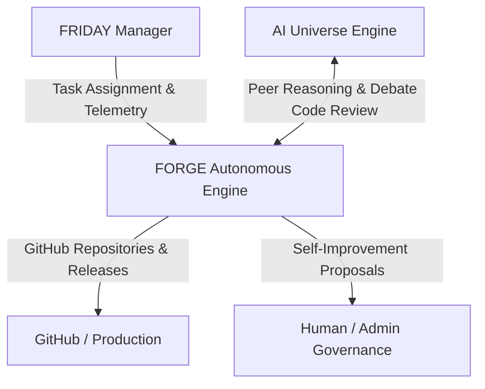

# FORGE — Ecosystem Integration & Autonomous Self-Improvement

Project FORGE functions as the autonomous software engineering synthesis engine within a distributed multi-agent ecosystem alongside **FRIDAY** (manager/orchestrator), **AI-Universe** (intelligence/reasoning engine), and **Trading Bot** (financial execution).



---

## 1. FRIDAY Manager Integration

### Webhook Event Dispatching
FORGE emits structured lifecycle events directly to FRIDAY (`POST /api/forge/events`) with 3-tier exponential backoff:
- `task_started`
- `stage_completed`
- `verification_result`
- `task_completed`
- `task_failed`

### Context Query
FRIDAY operators can inspect task metadata and correlation commands:
```http
GET /api/tasks/{task_id}/friday-context
```

---

## 2. Deep AI Universe Multi-Agent Intelligence

### Role-Specific Agent Routing
Prompts are dynamically dispatched to specialized AI Universe personas:
- `Architect`: System design and project file manifests.
- `Coder`: File-level implementation.
- `Debugger`: Automated repair and traceback fixing.
- `Security Analyst`: Vulnerability inspection.
- `Tester`: Unit and integration test suites.

### Multi-Agent Debate Code Review
Prior to delivery, code is reviewed by a 3-agent committee (`Coder + Critic + Security Analyst`):
- **Confidence $\ge 0.80$**: Auto-applies consensus fixes.
- **Confidence $0.50 - 0.79$**: Logs suggestions for human review.
- **Confidence $< 0.50$**: Safely keeps original generation.

---

## 3. Autonomous Self-Improvement Engine

FORGE analyzes failed runs over rolling 7-day windows, clusters root causes (missing dependencies, syntax regressions, verification assertions), and formulates concrete proposals.

> [!IMPORTANT]
> All self-improvement actions are strictly generated as **proposals**. No code modifications are applied without explicit approval:
> - `GET /api/improvement/report` — View active analysis and proposals.
> - `POST /api/improvement/apply/{proposal_id}` — Human-approved proposal execution.

---

## 4. Continuous Template Evolution

- **Pattern Mining**: Evaluates which template patterns produce the highest verification pass rates.
- **A/B Testing**: Ranks and promotes winning template variants for ambiguous requirements.

---

## 5. Build Pipeline Optimization

- **Parallel File Synthesis**: Independent files are synthesized concurrently with semaphore throttling.
- **Synthesis & Verification Caching**: In-memory LRU and disk cache for identical queries.
- **Incremental Diffs**: Only regenerates files that changed across iterations.
- **Pre-Synthesis Cost Estimator**: Calculates expected calls and tokens prior to launching tasks.

---

## 6. Multi-Project Queue & Concurrency Management

- **Priority Queue**: `urgent` > `high` > `normal`.
- **Preemption**: Urgent tasks preempt normal tasks after safe state checkpoints.
- **Workspace Retention**: Retains completed workspaces for 7 days, archives older sandboxes, and purges failed builds after 24 hours.

---

## 7. Automated GitHub Delivery

On completion, FORGE can automatically:
1. Create a remote repository (`forge-{task_id}`).
2. Push workspace files to the default branch.
3. Publish a GitHub release tagged with delivery notes.

---

## 8. Web Dashboard

An interactive dashboard is served at `http://localhost:8000/dashboard` featuring:
- Live 8-stage progress tracker and playback.
- Real-time WebSocket log streaming.
- Deep file and verification inspection.
- Aggregate performance analytics charts.
