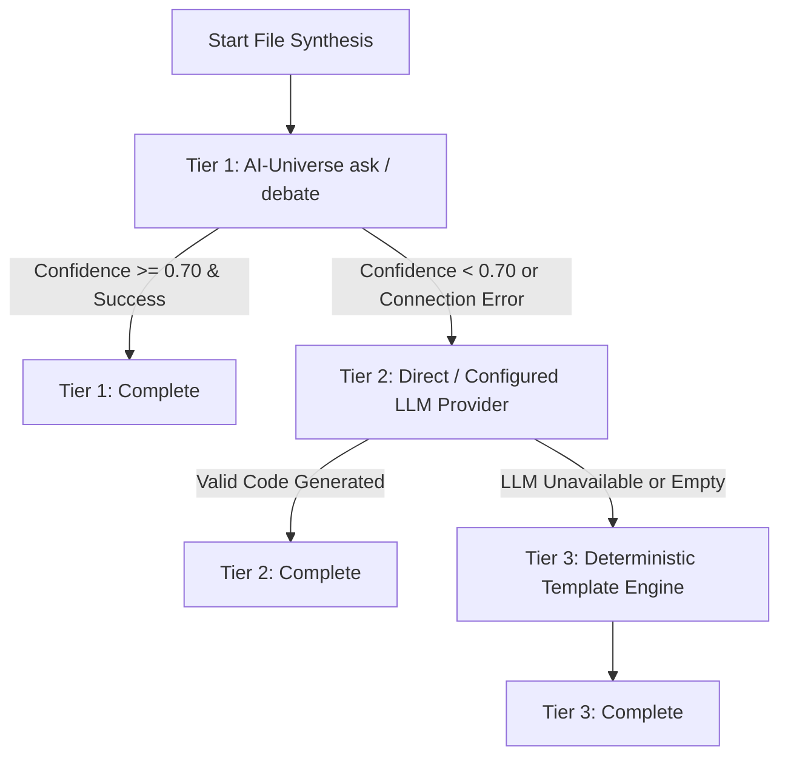

# FORGE — Project Types, Builders & Provider Fallback

Project FORGE specializes code generation, templates, and objective verification based on the inferred architectural category of each task.

---

## 1. Project Type Builders

| Archetype | Builder Class | Target Artifacts | Mandatory Verification |
|---|---|---|---|
| **Website** | `WebsiteBuilder` | `index.html`, `style.css`, `app.js`, `README.md` | Syntax, Lint, Runtime, Feature, Browser (Playwright), Accessibility (a11y) |
| **CLI Tool** | `CLIBuilder` | `main.py`, `test_main.py`, `requirements.txt`, `README.md` | Build, Ruff Lint, Pytest, Runtime, Security, Feature |
| **REST API** | `APIBuilder` | `main.py`, `test_main.py`, `requirements.txt`, `README.md` | Build, Ruff Lint, TestClient Pytest, Health Check, Security |
| **Script** | `ScriptBuilder` | `main.py`, `test_main.py`, `README.md` | Build, Lint, Pytest, Runtime, Security |

---

## 2. Multi-Provider Fallback Hierarchy

FORGE utilizes a 3-tier cascade for synthesizing code files:

### Provenance Tracking
Every synthesized file is tagged with its execution source. When tasks finish, FORGE computes the exact percentage contribution of each tier:
$$\text{AI-Universe } \% + \text{Direct } \% + \text{Template } \% = 100\%$$
This summary is exposed via `/api/tasks/{task_id}/inspect` and included in the final `completion_report.json`.

---

## 3. Template Engine & Starter Catalog

- **`TemplateEngine`**: Replaces `{{variable}}` placeholders in predefined component patterns.
- **Catalog Modules (`app/templates/catalog.py`)**:
  - Semantic HTML5 website starter with responsive CSS variables and dark-mode switcher.
  - Command-line tools with standard `argparse` subparsers, JSON storage manager, and `--help` / `--version` flags.
  - FastAPI services with Pydantic request/response validation, `/health` endpoint, in-memory CRUD, and TestClient test suites.
